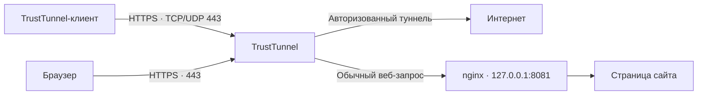

# TrustTunnel Guide

Свой TrustTunnel на VPS: объяснение, ручная установка и **TrustTunnel Installer** с интерфейсом на русском и английском.

[English](README.en.md) · [Ручная установка](docs/manual-install.md) · [Подключение клиентов](docs/clients.md) · [Обслуживание](docs/maintenance.md)

## 1. Что такое TrustTunnel и в чём его преимущества

[TrustTunnel](https://github.com/TrustTunnel/TrustTunnel) — открытый VPN-протокол и сервер от команды AdGuard. Клиент создаёт зашифрованный туннель до вашего сервера, через который идут подключения к интернету.

- **Работает поверх HTTPS.** Поддерживает HTTP/2 по TCP и HTTP/3 по QUIC/UDP. Это полезная альтернатива протоколам с другим сетевым профилем.
- **Свой сервер и свои доступы.** Вы выбираете VPS, домен и пользователей. Для этого рецепта не нужны панель управления или подписка на VPN-сервис.
- **TCP и UDP внутри туннеля.** Подходит для браузера и приложений, которым нужны разные типы соединений.
- **Готовые клиенты.** Есть приложения для телефона и компьютера; настройки можно передать ссылкой `tt://` или QR-кодом. [Официальные клиенты](https://github.com/TrustTunnel/TrustTunnel#clients).

<details>
<summary>Как устроен туннель и какой транспорт выбрать</summary>

Для каждого TCP-подключения TrustTunnel открывает отдельный HTTP-поток методом CONNECT. Несколько таких потоков используют одну транспортную сессию, поэтому для каждого сайта не требуется заново устанавливать соединение от VPN-клиента до VPS. UDP-датаграммы передаются через отдельный общий поток. [Спецификация протокола](https://github.com/TrustTunnel/TrustTunnel/blob/v1.1.0/PROTOCOL.md).

| Транспорт | Практическая разница |
| --- | --- |
| HTTP/2, TCP 443 | Работает в сетях, где доступен TCP, но ограничен UDP. Потери во внешнем TCP-соединении могут задерживать все его потоки. |
| HTTP/3, UDP 443 | QUIC разделяет восстановление данных разных потоков: потеря в одном не требует остановки остальных. При этом задержки внутри потока и ограничения общей сети сохраняются. |

HTTP/3 не обязательно быстрее в любой сети: проверьте оба режима на своём соединении. Пояснение вдохновлено [разбором на Хабре](https://habr.com/ru/companies/femida_search/articles/988466/); устройство потоков сверено с официальной спецификацией, поведение QUIC — с [RFC 9000](https://www.rfc-editor.org/rfc/rfc9000.html#section-2).

</details>

В нашем рецепте обычный посетитель домена видит страницу загрузки сайта, которую отдаёт **nginx**. TrustTunnel принимает VPN-соединения и передаёт обычные веб-запросы этому nginx.

Это не гарантирует обход любой блокировки: результат зависит от сети, доступности IP и используемых методов фильтрации. Заглушка делает ответ на обычный веб-запрос похожим на сайт; она не скрывает сам IP сервера.



## 2. Ручная установка на сервер

**[Пошаговый гайд →](docs/manual-install.md)**

В гайде: загрузка официального бинарника, проверка SHA-256, сертификат Let's Encrypt, конфигурация TrustTunnel, nginx с заглушкой, systemd и экспорт доступов. Все конфиги доступны в [templates](templates).

Для обоих способов понадобится:

| Что | Требование |
| --- | --- |
| VPS | Чистый Ubuntu 22.04 / 24.04 или Debian 12 / 13 с systemd |
| Архитектура | x86_64 или ARM64 |
| Доступ | SSH под root |
| Домен | A-запись напрямую на публичный IPv4 интерфейса VPS |
| DNS | Без AAAA и CDN-прокси; для Cloudflare — DNS only |
| Порты | Свободные 80/TCP, 443/TCP, 443/UDP и локальный 8081/TCP |
| Firewall | Разрешены входящие 80/TCP, 443/TCP и 443/UDP, включая firewall провайдера |

Этот рецепт использует IPv4. Серверы за NAT и существующие установки nginx требуют отдельной настройки. Порт 80 остаётся доступным для продления сертификата; постоянно работающего HTTP-сервера на нём нет.

## 3. Установка через TrustTunnel Installer

Скачайте этот репозиторий, откройте его каталог в терминале и запустите:

```bash
bash install.sh
```

Работает на Linux, macOS и Windows через WSL. На компьютере нужны Bash, OpenSSH и tar.

Вначале выберите язык:

```text
Choose language / Выберите язык:
  1) Русский
  2) English
```

Дальше откроется форма: сервер, домен, SSH-порт и необязательный ключ. Управление — стрелками и Enter, выход — `q`. TUI написан на Bash и не требует `gum`, `dialog` или Python на вашем компьютере. Если терминал не поддерживает TUI, доступны обычные текстовые подсказки. SSH использует ваш ключ или сам запросит пароль сервера. Служебный email для сертификата генерируется на сервере автоматически. Запуск означает согласие с [условиями Let's Encrypt](https://letsencrypt.org/repository/).

Можно сразу передать параметры:

```bash
bash install.sh --lang ru \
  --server root@203.0.113.10 \
  --domain tt.example.com
```

С ключом и нестандартным SSH-портом:

```bash
bash install.sh --lang en \
  --server root@203.0.113.10 \
  --domain tt.example.com \
  --identity ~/.ssh/id_ed25519 \
  --ssh-port 2222
```

В конце **прямо в терминале** появятся:

```text
TrustTunnel установлен. Данные подключения:

TrustTunnel
Домен: tt.example.com
Порт: 443
Логин: tt_…
Пароль: …

Ссылка для импорта:
tt://?…
```

Также **на вашем компьютере**, в `access/<домен>.<случайный суффикс>/`, сохраняются:

| Файл | Содержимое |
| --- | --- |
| `access.txt` | Домен, порт, логин и пароль |
| `connection.txt` | Полная ссылка `tt://` для импорта |
| `connection.png` | QR-код с этой ссылкой |
| `endpoint.toml` | Настройки сервера для мастера официального CLI-клиента |

Доступы защищены правами `600`, каталог — `700`, `access/` исключён из Git. Ссылка и QR-код тоже содержат пароль. Экспорт передаётся по SSH без сохранения файлов на VPS. На сервере остаётся рабочий `credentials.toml`, необходимый TrustTunnel для авторизации; метаданные установщика пароля не содержат.

Установщик проверяет DNS и занятые порты, скачивает официальный релиз с проверкой SHA-256, ставит nginx с заглушкой, выпускает сертификат и проверяет его продление. Запускает две systemd-службы и проверяет HTTPS-ответ сайта. В активном UFW добавляет необходимые правила; firewall провайдера настройте заранее. Установщик не включает выключенный UFW.

При повторном запуске с тем же доменом и версией пароль и пользовательские конфиги сохраняются; службы перезапускаются. Старые серверные копии экспортов и дубль пароля в метаданных удаляются. Чужая установка или занятый порт останавливают первичную установку с объяснением. Для изменения пользователей и обновления версии есть [отдельная инструкция](docs/maintenance.md).

**После установки подключитесь в приложении:** [импорт ссылки и проверка VPN](docs/clients.md). Успешная проверка сайта сама по себе ещё не проверяет туннель из вашей сети.

---

Рецепт закреплён на [TrustTunnel 1.1.0](https://github.com/TrustTunnel/TrustTunnel/releases/tag/v1.1.0); версии и контрольные суммы — в [versions.env](versions.env). [Проверки проекта](tests/README.md). Сообщения самого установщика доступны на RU/EN; системные утилиты показывают собственный вывод.
